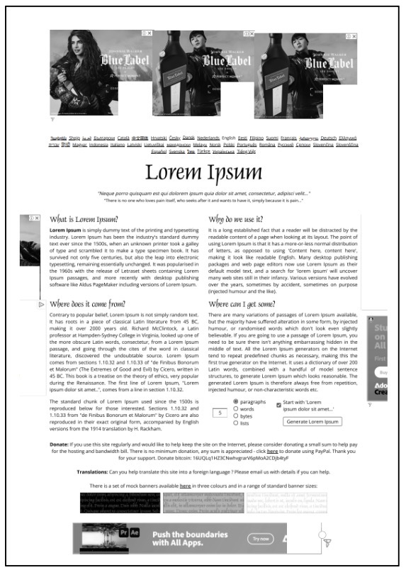
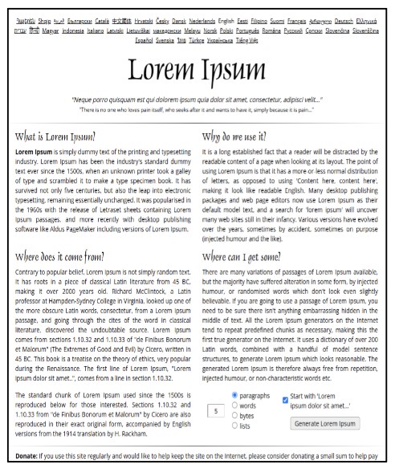

# HTML & CSS

## Overview

[HTML (HyperText Markup Language)](https://developer.mozilla.org/en-US/docs/Web/HTML) and [CSS (Cascading Style Sheets)](https://developer.mozilla.org/en-US/docs/Web/CSS) are the foundational technologies for building web pages.

HTML is a markup language that provides the structure of the page, while CSS is used to control the presentation, formatting, and layout.

## Web Application: Intro to HTML and CSS

### HyperText Markup Language (HTML): Defines Structure and Content of a Webpage

HTML is a **standard markup language** for describing web documents (web pages).

In 1989, Tim Berners-Lee invented the Web with HTML as its publishing language.
HTML (HyperText Markup Language) was created to help programmers describe the content on a website.

HTML uses **nested tags** to help you add paragraphs, headers, pictures, bullets and other pieces of structure for **semantic markup** of a document.

**Further reading:** [Introduction to HTML](https://www.w3schools.com/html/html_intro.asp), [HyperText Markup Language](https://developer.mozilla.org/en-US/docs/Web/HTML)

#### HTML tags

Content on a webpage is generally **enclosed** in tags that look like `

`.

These tags demarcate HTML elements that are placed on the page.

**Some basic tags:**

The HTML document: `<html>`

**Page sections:**   `<head>`, `<header>`, `<nav>`, `<main>`, `<body>`, `<footer>`, ...

**Headers:**         `<h1>`, `<h2>`, `<h3>`, ..., `<h6>`

**Text elements:**   `<title>`, `
`, ` `, `
`, ...

HTML elements can be nested inside each other, with some exceptions.

#### Using DevTools

DevTools is a powerful "debugger" for web programming and scripting, used by students and professionals alike. It is invoked using the `<Ctrl+Shift+C>` hotkey.

For this task, we will use NYJC's official website: https://www.nanyangjc.moe.edu.sg/

As you browse the page, right click on different elements and click **Inspect**. What do you see?

### Cascading Style Sheets (CSS): Controls the visual presentation and styling of content

#### CSS: Cascading Style Sheets

CSS describes how HTML elements are to be displayed on screen, paper, or in other media.

**CSS** was first proposed by Hakom Lie and co-created by Bert Bos around 1996. **Created to compliment HTML, CSS** (Cascading Style Sheets) is what **makes a website look and feel amazing**. Presentation and ease of use have been some of the qualities CSS has brought to web development. It is more **involved with changing** a website’s **style rather than** its **content**.

Similar to how changing the font size, font color and positioning on a word document helps with its styling and display, CSS applies **styling rules** to define how the content looks on a webpage and what else goes on to complement that content.

**Further reading:** [Cascading Style Sheets](https://developer.mozilla.org/en-US/docs/Web/CSS), [Selectors](https://developer.mozilla.org/en-US/docs/Learn_web_development/Core/Styling_basics/Basic_selectors)

#### Exploration

Head back to NYJC’s official website:
https://www.nanyangjc.moe.edu.sg/

*Task:*
● *Inspect* the various elements on the webpage.
● *Uncheck* certain *property-value pairs* in the *Styles Panel*. What do you see?
● Continue exploring the selectors in the *Styles Panel*; change the property values to see the corresponding changes in the webpage.

## CHECKPOINT

### Final Task for the lesson

Head to the website:
https://www.lipsum.com/

Task:
● Using the **DevTools**, alter the HTML such that the adverts are not visible and the page is suitable for print, as shown.

Original

Final

### Self-study

**Before the lab session:**
Revise the Notes: [HyperText Markup Language (HTML)](https://docs.google.com/document/d/1zsf3OKFuIKi9SgvS3mflEWCJs7bN8N6NT07MMgjVa5E/edit?tab=t.0#heading=h.uofmalyg35wi), [Cascading Style Sheets (CSS)](https://docs.google.com/document/d/1zsf3OKFuIKi9SgvS3mflEWCJs7bN8N6NT07MMgjVa5E/edit?tab=t.0#heading=h.4zpwrve0iwkt)

Take the [quiz on W3Docs.com](https://www.w3docs.com/quiz-start/html-basic)

**When you have the time:**

Complete MDN’s [Getting Started with HTML](https://developer.mozilla.org/en-US/docs/Learn_web_development/Core/Structuring_content/Basic_HTML_syntax), [Document and website structure](https://developer.mozilla.org/en-US/docs/Learn_web_development/Core/Structuring_content/Structuring_documents). (I have no access to either link, I'm not sure where they lead or if others will have access)

Check out the handy [HTML Cheat sheet](no access to drive, can't put link)

Take a peek at the online [HTML & CSS Interactive Cheat Sheet](https://htmlcheatsheet.com/)

### Next Lesson

HTML/CSS for Github portfolio
- Create a GitHub page and portfolio

If you are struggling, remember:
Some developers dedicate their **entire careers** to mastering HTML, CSS, and Javascript.

You are learning and using *the same language* as these professionals.

**You are not expected to know everything at one go!**